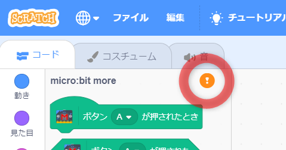

# Microbit More の使い方

## micro:bitを準備する

### 1. micro:bit にプログラムを書き込む
micro:bit をUSBケーブルでパソコンにつないで、最新の Microbit More 用プログラム を micro:bit へ書き込みます。(micro:bit へのプログラム書き込みは最初の1回だけで、以降は Scratch の操作のみでつなぐことができます。)

Microbit More 用プログラム [microbit-mbit-more-v2-0_2_5.hex](https://github.com/microbit-more/pxt-mbit-more-v2/releases/download/0.2.5/microbit-mbit-more-v2-0_2_5.hex)

### 2. micro:bit の方角センサーを調整する
プログラムを書き込んだ直後は方角センサーを調整するために、LED画面に「TILT TO FILL SCREEN」と表示されます。 micro:bit を前後左右に傾けて、すべてのLEDが光っている状態にしてください。(この調整を完了するまでスクラッチをつなぐことはできません。)

## micro:bit をつなぐ

### 1. Microbit More を開く

ウェブブラウザで https://microbit-more.github.io/editor を開きます。
(Web Bluetooth API に対応していないブラウザ(FireFox や Safari など)で使うときは、そのパソコンに [Scratch Link](https://scratch.mit.edu/microbit) をインストールして動かしておいてください。)

### 2. micro:bit を探す

'Microbit More' カテゴリのコネクトボタンを押して、近くにある Microbit More の書き込まれた micro:bit を探します。

### 3. micro:bit を選ぶ

つなぎたい micro:bit の名前(LEDに流れる5文字の英文字)をmicro:bit のリストから選んで「ペア設定」を押します。
接続できたら「エディターへ行く」ボタンを押します。

### 4. 接続を確認する

「パターン ♡ を表示する」をクリックして、どの micro:bit と接続されたのかを確認してみましょう。

## USBで micro:bit をつなぐ

1. Web Serial API に対応しているブラウザ(Chrome/Edge v89以降)で https://microbit-more.github.io/editor を開きます。
2. micro:bit をUSBケーブルでPCにつなぎます。
3. シフトキーを押しながらコネクトボタンをクリックします。
4. シリアルポートの一覧から micro:bit を選んで接続します。

____
## オフラインで使う

Microbit More エディターは PWA(Progressive Web Apps) になっているので、オフラインで利用できます。
エディター( https://microbit-more.github.io/editor )を開いて2分ほど置いておくと、アドレスバーにインストールボタンが現れます。

インストールボタンが現れた後はエディターがブラウザにまるごとキャッシュされているので、たとえインストールしなくても、ネットアクセス無しで Microbit More を利用できるようになっています。
